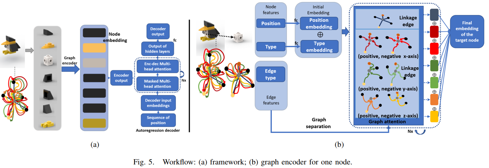

# ICRA_ASP (Planning Assembly Sequence with Graph Transformer)

Submited to International Conference on Robotics and Automation 2023. Paper created by Lin Ma, Jiangtao Gong, Hao Xu, Hao Chen, Hao Zhao, Wenbing Huang, Guyue Zhou from Institute for [AI Industry Research(AIR), Tsinghua University](https://air.tsinghua.edu.cn/). Our paper is avaliable on (https://arxiv.org/abs/2210.05236)

## Introduction
Assembly sequence planning (ASP) is the essential process for modern manufacturing, proven to be NP-complete thus its effective and efficient solution has been a challenge for researchers in the field.

 In this paper, we present a graph-transformer based framework for the ASP problem which is trained and demonstrated on a self-collected ASP database. The ASP database contains a self-collected set of LEGO models. The LEGO model is abstracted to a heterogeneous graph structure after a thorough analysis of the original structure and feature extraction. The ground truth assembly sequence is first generated by brute-force search and then adjusted manually to in line with human rational habits. Based on this self-collected
ASP dataset, we propose a heterogeneous graph-transformer framework to learn the latent rules for assembly planning. We evaluated the proposed framework in a series of experiment. The results show that the similarity of the predicted and ground truth sequences can reach 0.44, a medium correlation measured by Kendall’s τ. Meanwhile, we compared the different effects of node features and edge features and generated a feasible and reasonable assembly sequence as a benchmark for further
research.


## Getting Started

### Installation
```
conda env create --name LEGO_GT python= 3.7.13
conda insatall --yes --file requirements.txt
```
### System Requirements
- Python 3.7
- Cuda 11.7
- GPU w/ minimum 3 GB ram


### Data Preparation 
- The data set we used is generated from LEGO models in `*.io` type stored in the doucument named `LEGO_models`.  
- We convert the LEGO model to heterogeneous graph in both `*.txt` and `*.data (pickle)` types stored in the documents named `data_in_txt` and  `data` , respectively.   

### Framework

 Our framework consists of two parts, graph encoder and transformer decoder, shown in the fllowing picture.

 

### Experiment

- We upload all the code for experiments in master. The name of the file corresponds to the design of the experimental section.


- For example, p2p_linkM_position.py represents the training program, in which the link relation of bricks act as the edge feature ad the position act as node feature. Moreover, the corresponding test file is named test_p2p_linkM_position.py

- Analogously, p2p_blockM_linkM_position_type.py represents the training program, in which both the link relationship and block act as edge features as well as both the position and type act as node features. Moreover, the corresponding test file is named test_p2p_blockM_linkM_position_type.py

- we added some brife notes on p2p_blockM_linkM_position_type.py

- We also design an in-process task.  It's test file is named test_semi_product.py.

- The trained model, loss and results are saved to the directories named saved_model, loss and test, respectively. 

